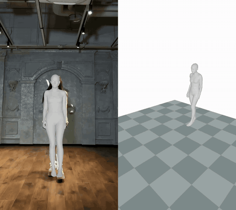
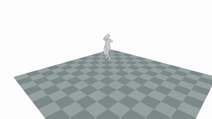
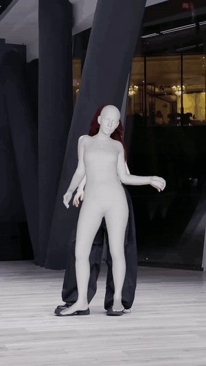
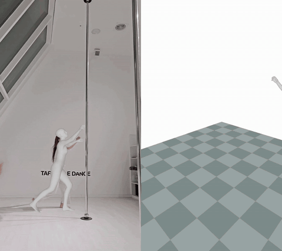

# MocapOS — Full Body + Hands Motion Capture

**MocapOS** turns a single video into 3D body **and hand** motion capture, with a
simple desktop GUI and a **portable installer that compiles nothing** on your
machine. It builds on [GVHMR](https://github.com/zju3dv/GVHMR) (body) and
[HaMeR](https://github.com/geopavlakos/hamer) (hands).

> ⚠️ **Non-commercial project.** MocapOS is free for research, learning, and
> personal/non-profit use. It bundles components that **forbid commercial use**
> (GVHMR, SMPL/SMPL-X/MANO) or require special licensing (YOLOv8/AGPL). See
> [`THIRD_PARTY_LICENSES.md`](THIRD_PARTY_LICENSES.md) before doing anything
> commercial. The MocapOS-authored code is under
> [PolyForm Noncommercial 1.0.0](LICENSE-MocapOS.md).

---

## Install (Windows, NVIDIA GPU)

No Build Tools, no compiling, no `conda activate`. A pre-built environment is
downloaded automatically and matched to your GPU.

1. **Clone** this repo (it is small — the heavy files are not here):
   ```bash
   git clone https://github.com/LokoJeans27/MocapOS.git
   cd MocapOS
   ```
2. **Run** `setup.bat` (double-click, or from a normal `cmd`). It will:
   - Detect your GPU and pick the right environment
     (RTX 50xx → CUDA 12.8, everything older → CUDA 12.4).
   - Download the portable env (~5 GB, **one-time**) from Hugging Face.
   - Download + verify the public tracking models (~12 GB, hash-checked).
   - Run a self-test and create a Desktop shortcut.
3. **Licensed models (one-time):** SMPL/SMPL-X (body) and MANO (hands) are **not**
   included (Max Planck license). The GUI has a one-click importer for each — full
   step-by-step in **[docs/INSTALL_GUIDE.md](docs/INSTALL_GUIDE.md)**. In short:
   - SMPL-X: <https://smpl-x.is.tue.mpg.de/> · SMPL: <https://smpl.is.tue.mpg.de/>
     → point the GUI to them (Settings > Body Models).
   - MANO: <https://mano.is.tue.mpg.de/> → copy `MANO_LEFT.pkl` + `MANO_RIGHT.pkl`
     into `hamer_lib/_DATA/data/mano/`. Without MANO the **body** still works; only
     **hand** capture is skipped.

When the self-test prints `RESULT: READY`, launch MocapOS from the Desktop icon.

### Tested GPUs
- **CUDA 12.8** build: RTX 50xx (Blackwell). Verified on RTX 5070 Ti.
- **CUDA 12.4** build: GTX 1000 / RTX 2000 / 3000 / 4000. Verified on GTX 1660 Ti.

---

## How it works

```
GitHub  (code, ~44 MB)          Hugging Face (weights, free)
  setup.bat ───────────────►  env_cu124.tar.gz / env_cu128.tar.gz
                              + public tracking models
SMPL / SMPL-X ── downloaded by the user (licensed)
```

The portable environments are hosted on Hugging Face at
[`LokoJeans/mocapos-envs`](https://huggingface.co/LokoJeans/mocapos-envs)
and fetched by `setup.bat`. Nothing heavy ever lives in git.

---

## Demo / Results

Raw outputs **straight from the model** on complex dance footage — **no cleanup at all**.
As with any motion capture, real production use still needs the usual pass (cleaning
curves, smoothing frames, fixing/retiming bad frames). Shown here just to illustrate what
the pipeline produces out of the box. *(Previews are short, low-fps GIFs — full-quality
MP4 links below.)*

### Good results — body + hands on fast dance

Camera overlay + 3D global view, side by side:



| 3D global (mesh only) | Camera overlay with hands |
|:---:|:---:|
|  |  |

### Where it struggles

The model isn't magic — fast, ambiguous or occluded motion drifts and hands get noisy.
A good example of where manual cleanup would be needed:



**Full-quality MP4s:**
[side-by-side](docs/demos/good_01_compare.mp4) ·
[overlay 1](docs/demos/good_01_overlay.mp4) ·
[overlay 2](docs/demos/good_02_overlay.mp4) ·
[overlay 3](docs/demos/good_03_overlay.mp4) ·
[3D global](docs/demos/good_03_global.mp4) ·
[limits overlay](docs/demos/limits_overlay.mp4) ·
[limits side-by-side](docs/demos/limits_compare.mp4)

> Dance clips are used because the motion is genuinely hard to follow, yet the result is
> still a solid starting point. Shown for research/demonstration only.

---

## Credits & Citation

MocapOS would not exist without **GVHMR** and **HaMeR**. If you use it, please cite
the original works:

```bibtex
@inproceedings{shen2024gvhmr,
  title={World-Grounded Human Motion Recovery via Gravity-View Coordinates},
  author={Shen, Zehong and Pi, Huaijin and Xia, Yan and Cen, Zhi and Peng, Sida
          and Hu, Zechen and Bao, Hujun and Hu, Ruizhen and Zhou, Xiaowei},
  booktitle={SIGGRAPH Asia Conference Papers},
  year={2024}
}

@inproceedings{pavlakos2024reconstructing,
  title={Reconstructing Hands in 3D with Transformers},
  author={Pavlakos, Georgios and Shan, Dandan and Radosavovic, Ilija and Kanazawa,
          Angjoo and Fouhey, David and Malik, Jitendra},
  booktitle={CVPR},
  year={2024}
}
```

## License

- MocapOS-authored code: [PolyForm Noncommercial 1.0.0](LICENSE-MocapOS.md)
- GVHMR (preserved): [`LICENSE`](LICENSE)
- All bundled components: [`THIRD_PARTY_LICENSES.md`](THIRD_PARTY_LICENSES.md)
